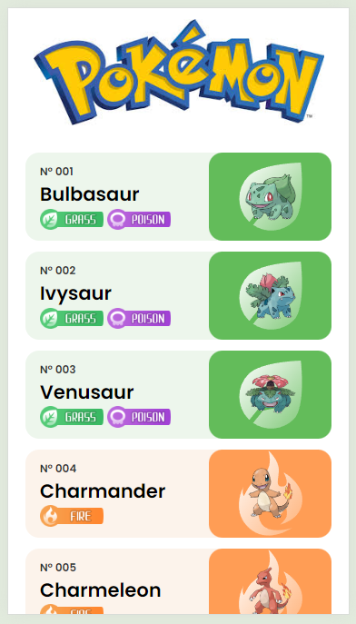
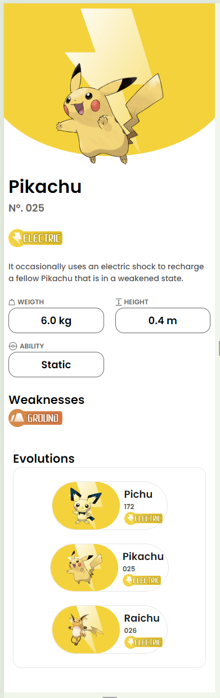

# Pokedex app with React + Typescript

I created this simple app to practice my react + typescript skills. This project was bootstrapped with [Create React App](https://github.com/facebook/create-react-app).

# Live
[See it live](https://melskywalker.github.io/react-pokedex/)

## UI
I used the [Pokedex app design by Junior Saraiva on Figma](https://www.figma.com/community/file/1202971127473077147).

## API
I used the [pokeApi](https://pokeapi.co/)

## Images
For the images I used the ones from [pokeApi sprites](https://github.com/PokeAPI/sprites)

## Screenshots

## Available Scripts

In the project directory, you can run:

### `npm start`

Runs the app in the development mode.\
Open [http://localhost:3000](http://localhost:3000) to view it in the browser.

### `npm run build`

Builds the app for production to the `build` folder.\
